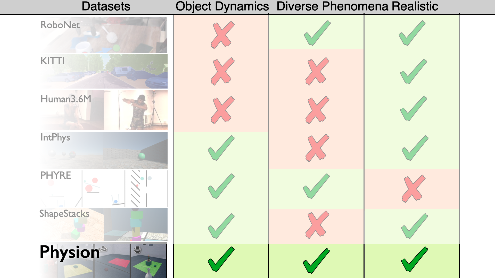
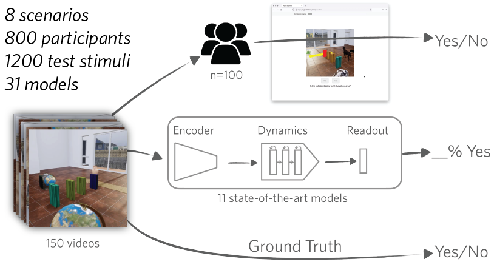
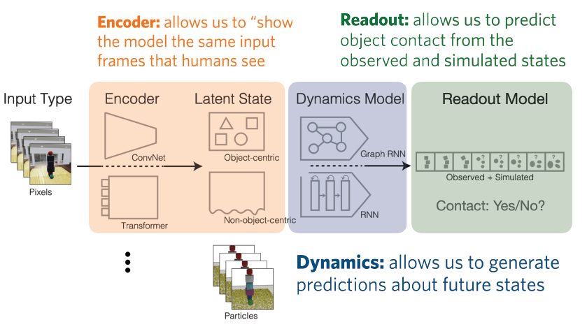
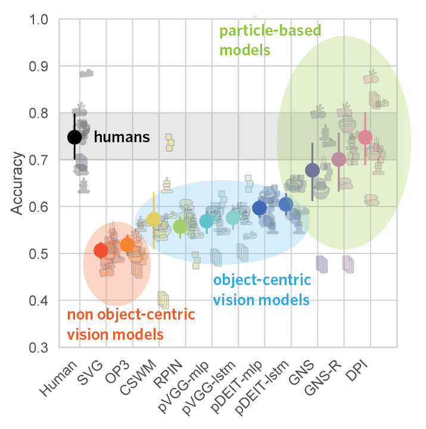

_Safe and effective AI requires algorithms that understand the everyday physical world -- how objects move, interact, and can be manipulated to achieve our goals. **Physion** is a dataset and benchmark that allows us, for the first time, to ask: Do today's state-of-the-art AI models understand diverse, commonplace physical phenomena as well as people do? 

**Physion** tests models against human judgments on 1200 videos in which objects roll, slide, fall, collide, deform, and more. We show that humans far surpass current computer vision algorithms at predicting how scenes unfold; however, endowing these models with more physically explicit scene representations is a promising path toward more human-like intuition._

_Watch a short video describing **Physion**_:

    <iframe width="560" height="315" src="https://www.youtube.com/embed/Jz7ImDazcJI" title="YouTube video player" frameborder="0" allow="accelerometer; autoplay; clipboard-write; encrypted-media; gyroscope; picture-in-picture" allowfullscreen style="left:0; top:0; height:100%; width:100%; position:absolute"></iframe>

    <video loop autoplay muted controls style="width:100%; height:auto">
        <source src="static/scenario_animation.mp4" type="video/mp4">
    </video>

Almost all of our behavior is guided by _intuitive physics_: our implicit knowledge of how different objects and materials behave in a wide variety of common scenarios. We know to stack boxes from largest to smallest, to place a cup on its flat base rather than its curved side, and to hook a coat on a hanger lest it fall to the floor. As AI algorithms begin to play larger roles in our daily lives, we must ensure that they, too, can make safe and effective decisions. But do they understand the physical world well enough to do so?

### Probing physical understanding in machines
To answer this question, we need a way of “asking” an AI model how it perceives a physical scenario. Two approaches have been popular in prior work: (1) training models to answer questions about simple synthetic scenarios, such as [whether a stack of toy blocks will fall over](https://openaccess.thecvf.com/content_ECCV_2018/papers/Oliver_Groth_ShapeStacks_Learning_Vision-Based_ECCV_2018_paper.pdf) or an object will [emerge from behind an occluder](https://intphys.com/index.html); and (2) training and testing large neural networks on the task of _video synthesis_, i.e. asking them to [predict the upcoming frames of a movie](https://arxiv.org/pdf/1802.07687.pdf).

Each of these approaches, despite some appeal, has severe drawbacks. The former dovetails with research in cognitive science, which has found that people can make [accurate predictions about key physical events](https://www.pnas.org/content/110/45/18327.short), like the tower falling, while abstracting away low-level details. To date, however, this sort of benchmarking in AI has been restricted to a small number of highly simplified scenarios that fail to capture the variety and complexity of everyday physics.

The latter strategy of video synthesis, on the other hand, makes few assumptions about how an algorithm should understand physical scenarios, allowing large neural networks to be trained and tested on real, unlabeled visual data. For this reason, video synthesis is a popular training task in robotics: if an agent can make accurate predictions about how its environment will change based on the actions it takes, then it should be able to accomplish its goals. But predicting everything about how a scene will change is enormously hard, [even with gargantuan datasets](https://arxiv.org/abs/2106.13195). As a result, these models currently succeed only in restricted, relatively narrow domains. Moreover, humans do not even [_see_](https://en.wikipedia.org/wiki/Inattentional_blindness) everything that happens in a movie, let alone predict it; the visual synthesis task is therefore unlikely to capture the intuitive physics that allows us to generalize our knowledge and achieve our goals in new, wide-ranging settings. 

### Physion: a diverse and challenging benchmark for visual intuitive physics 
To fill the large gap between these approaches, we need a way to test for _human-like_ physical understanding in _diverse, challenging, and visually realistic environments_. We therefore introduce the **Physion Dataset and Benchmark**. Our key contributions are
* Training and testing sets for _eight realistically simulated and rendered 3D scenarios_ that probe different aspects of physical understanding: how objects roll, slide, fall, and collide; how one object may support, contain, or attach to another; and how multiple objects made of different materials interact.
* A _unified testing procedure_ for comparing AI models to humans on a challenging prediction task, which depends on grasping the physical phenomena in the Physion dataset.
* An initial _evaluation of state-of-the-art computer vision and graph neural network models_ on the Physion benchmark, the results of which suggest that today’s algorithms will need to incorporate more physically explicit, object-centric visual scene representations to reach human-like ability.

#### Creating a diverse and challenging benchmark 
On a visually and physically narrow benchmark, many state-of-the-art models could overfit and achieve “super-human performance” without understanding everyday physics in the generalizable, flexible way that people do. On the other hand, a benchmark that relied too much on higher level knowledge, such as asking what will happen next in YouTube videos, would not test intuitive physical understanding. We therefore took an intermediate approach to designing Physion: each of its eight scenarios focuses on specific (but partly overlapping) physical phenomena that occur often in everyday life. Stimuli for each scenario were physically simulated and visually rendered using the highly realistic, Unity3D-based [ThreeDWorld environment](https://www.threedworld.org/), which adeptly handles diverse physics like projectile motion and object collisions, rolling and sliding across surfaces of varying friction, and clothlike or deformable material interactions. We provide training and testing sets of 2000 and 150 movies, respectively, for each scenario, as well as code for generating additional training data.

    

#### Directly comparing humans to machines at physical understanding 
To measure how well both models and people understand each scenario, we created a common readout task for all stimuli: _Object Contact Prediction_. This task has a person or model observe the first 1.5 seconds of each Physion movie, then make a binary prediction about whether two of the objects in the scene -- indicated by their red and yellow appearance -- will come into contact during the remaining, unseen portion of the movie. People easily grasp this task and make accurate predictions, even when the stimuli are challenging (see below.) To measure model behavior, we adapted the standard method of _transfer learning_ to our prediction task: models pretrained on unlabeled Physion data, other datasets (like ImageNet), or both, are fit with a linear readout of their learned features to make binary predictions about upcoming object contact. Since models and humans make predictions for the same task on the same stimuli, we can directly compare their behavior as a function of model architecture, pretraining task, and which subsets of learned features are used to make the object contact prediction.

    

### How do today’s AI algorithms measure up to humans? 
Humans make accurate predictions about the Physion stimuli, but they aren’t perfect: across 100 participants per scenario, average performance on the prediction task was ~75%. Some scenarios appeared to be more challenging than others: for instance, people had a harder time judging the effects of object-object attachment in the **Link** scenario than how objects would move down a ramp or across the floor in the **Roll** scenario. Moreover, some stimuli in each scenario appeared to be “physically adversarial”: most people predicted one outcome, but in the ground truth movie the opposite occurred -- often due to a physical fluke, like an object teetering on the brink of falling over. Imperfect human accuracy on Physion is a feature of our approach, not a bug: it means that a (hypothetical) super-human model might be overfitting or picking up on cues that people don’t use to make physical predictions. Since abstracting away low-level detail is an important part of how we make general, fast, and efficient judgments, it is important to know whether current and future AI models do the same.

For the time being, however, the state-of-the-art in computer vision appears to be far behind humans at making physical predictions: _none of the vision neural networks we tested_, whether they were trained on video synthesis or supervised tasks, used an object-centric or structureless scene representation, or had a convolutional or transformer-based encoder architecture, came close to human performance on the Physion benchmark. While the models that received object-related learning signals fared slightly better than those that didn't, control experiments suggested that these models often do not even make human-like judgments about what they _observe_, let alone make human-like predictions. Thus, current vision models appear to lack essential components of human intuitive physics.

    

#### What’s missing from computer vision models for physical understanding? 
Fortunately, the way to close this large gap between models and machines isn't a total shot in the dark: we were able to find cases where neural networks _can_ perform as well as people. Algorithms called Graph Neural Networks (GNNs) made predictions on some of the Physion scenarios as accurately as humans, suggesting that they may hold some of the keys to intuitive physical understanding. However, these models have an enormous advantage over human participants: instead of receiving visual input (i.e., movies), they operate on the _ground truth physical state_ of the ThreeDWorld simulator. This means that they have near-perfect knowledge of each object’s boundaries, 3D shape, and fine-scale trajectory; are unhindered by occlusion or by only seeing the front surfaces of objects; and are explicitly told which parts of the scene can be ignored or compressed into a more efficient representation. 

Thus, these models bypass the amazing computations our brain uses to parse a scene as a set of [physical objects moving through 3D space](https://onlinelibrary.wiley.com/doi/pdf/10.1207/s15516709cog1401_3#:~:text=Object%20perception%20does%20accord%20with,each%20other%20only%20on%20contact) -- computations that emerge, without direct supervision, [by the end of human infancy](https://pubmed.ncbi.nlm.nih.gov/10349761/). The GNNs’ success suggests, though, that if we understood these computations -- that is, if we could implement visual encoding models that produce object-centric, physically explicit scene representations like the ones the GNNs use -- then we might obtain algorithms with (more) human-like physical understanding. Such vision models are therefore an attractive target for future work and for using Physion to bring AI more in line with human intuitive physics.

    

